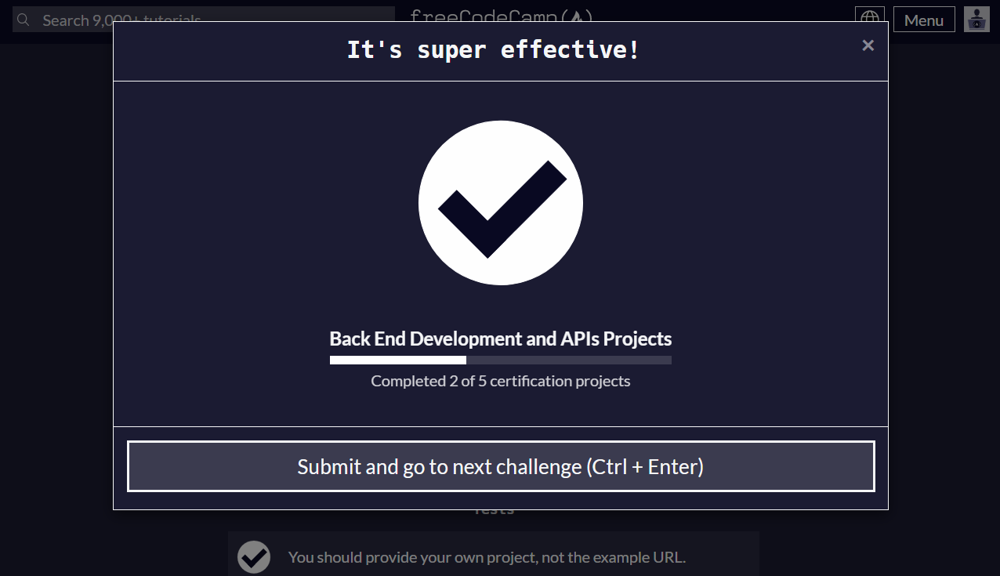

# Request Header Parser Microservice

This is the result code for the Request Header Parser Microservice project. It extracts information from the request headers, including the IP address, preferred language, and software details. Instructions for building the project can be found at https://www.freecodecamp.org/learn/apis-and-microservices/apis-and-microservices-projects/request-header-parser-microservice

## Tests

The following tests ensure the correctness of the microservice:

- A request to /api/whoami should return a JSON object with your IP address in the ipaddress key.
- A request to /api/whoami should return a JSON object with your preferred language in the language key.
- A request to /api/whoami should return a JSON object with your software in the software key.

## Submission

$$
$$
